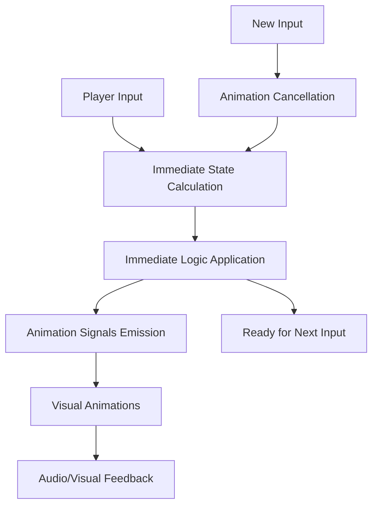

# Architecture: Logic / Animation Separation

## 🎯 Objective

Completely separate **game logic** from **visual animations** to enable:
- ✅ **Immediate state** : All state changes are applied instantly
- ✅ **Parallel animations** : Animations launch in parallel without blocking
- ✅ **Safe interruption** : A new move can cancel animations without impacting logic
- ✅ **Responsiveness** : Players can chain moves rapidly

---

## 🏗️ Current Architecture (Problematic)

### ❌ Identified Issues

```gdscript
# ISSUE 1: Logic dependent on animations
func process_movement(direction: Direction):
    # ... movement logic ...
    
    # ❌ Waiting for animation before continuing
    await get_tree().create_timer(0.3).timeout
    
    # ❌ Logic AFTER animation
    process_fusions(fusions)
    spawn_random_tile()
    update_ice_timers()

# ISSUE 2: Power activated after animation
func process_fusions(fusions):
    # ... fusion animations ...
    await get_tree().create_timer(0.3).timeout
    
    # ❌ Power activation AFTER animation
    if power_to_activate != null:
        await PowerManager.activate_power(power_to_activate, power_tile, self)

# ISSUE 3: States modified during animations
func apply_enemy_power():
    # Power ball animation
    power_ball_animation_requested.emit(random_power, position)
    
    # ❌ Waiting before applying power
    await get_tree().create_timer(0.7).timeout
    
    # ❌ State modification AFTER animation
    tile.power_type = power
```

---

## 🎯 New Architecture (Solution)

### ✅ Core Principle

**ALL game logic must be applied IMMEDIATELY, animations are only visual feedback**



---

## 🔧 Implementation: GridManager

### Phase 1: Immediate State Calculation

```gdscript
# ✅ NEW ARCHITECTURE
func process_movement(direction: Direction) -> bool:
    if not can_move:
        return false
    
    # 1. ✅ IMMEDIATE CALCULATION of all new states
    var movement_result = calculate_movement_result(direction)
    if not movement_result.has_changes:
        return false
    
    # 2. ✅ IMMEDIATE APPLICATION of all changes
    apply_movement_result_immediately(movement_result)
    
    # 3. ✅ PARALLEL LAUNCH of animations (non-blocking)
    launch_movement_animations(movement_result)
    
    # 4. ✅ Ready for next input IMMEDIATELY
    return true

# ✅ Pure calculation without side effects
func calculate_movement_result(direction: Direction) -> MovementResult:
    var result = MovementResult.new()
    result.direction = direction
    result.moved_tiles = []
    result.fusions = []
    result.destroyed_tiles = []
    result.new_tiles = []
    result.activated_powers = []
    
    # Simulate movement without modifying actual state
    var simulated_grid = duplicate_grid()
    
    match direction:
        Direction.UP:
            _simulate_movement_up(simulated_grid, result)
        # ... other directions
    
    # Calculate fusions
    _calculate_fusions(result)
    
    # Calculate activated powers
    _calculate_activated_powers(result)
    
    # Calculate power effects (destruction, etc.)
    _calculate_power_effects(result)
    
    # Calculate new tile to spawn
    _calculate_new_tile_spawn(result)
    
    return result

# ✅ Immediate application without animation
func apply_movement_result_immediately(result: MovementResult):
    # Apply all changes to game state
    
    # 1. Move tiles in grid
    for moved_tile in result.moved_tiles:
        move_tile_immediately(moved_tile.tile, moved_tile.from_pos, moved_tile.to_pos)
    
    # 2. Apply fusions
    for fusion in result.fusions:
        apply_fusion_immediately(fusion)
    
    # 3. Destroy tiles (powers)
    for destroyed_tile in result.destroyed_tiles:
        destroy_tile_immediately(destroyed_tile)
    
    # 4. Apply power effects
    for power_effect in result.activated_powers:
        apply_power_effect_immediately(power_effect)
    
    # 5. Create new tiles
    for new_tile_data in result.new_tiles:
        create_tile_immediately(new_tile_data)
    
    # 6. Update counters
    move_count += 1
    update_ice_timers()
    
    # 7. Check game over
    if not has_valid_moves():
        game_over.emit()

# ✅ Non-blocking parallel animations
func launch_movement_animations(result: MovementResult):
    # All animations launch in parallel
    
    # Tile movement animations
    for moved_tile in result.moved_tiles:
        animate_tile_movement(moved_tile)
    
    # Fusion animations
    for fusion in result.fusions:
        animate_fusion(fusion)
    
    # Power effect animations
    for power_effect in result.activated_powers:
        animate_power_effect(power_effect)
    
    # Destruction animations
    for destroyed_tile in result.destroyed_tiles:
        animate_tile_destruction(destroyed_tile)
```

### Phase 2: Data Structures

```gdscript
# ✅ Structure to encapsulate all changes from a movement
class MovementResult:
    var direction: Direction
    var has_changes: bool = false
    var moved_tiles: Array[MovedTileData] = []
    var fusions: Array[FusionData] = []
    var destroyed_tiles: Array[DestroyedTileData] = []
    var activated_powers: Array[PowerEffectData] = []
    var new_tiles: Array[NewTileData] = []

class MovedTileData:
    var tile: Tile
    var from_pos: Vector2i
    var to_pos: Vector2i

class FusionData:
    var tile1: Tile
    var tile2: Tile
    var result_tile: Tile
    var position: Vector2i
    var power_activated: String = ""

class PowerEffectData:
    var power_type: String
    var source_tile: Tile
    var affected_positions: Array[Vector2i] = []
    var blocked_directions: Array[Direction] = []

class DestroyedTileData:
    var tile: Tile
    var position: Vector2i
    var cause: String  # "power", "fusion", etc.

class NewTileData:
    var value: int
    var power_type: String
    var position: Vector2i
```

---

## 🎮 Implementation: Power Management

### ✅ Immediate Power Activation

```gdscript
# ✅ PowerManager - Immediate effect calculation
func calculate_power_effects(power_type: String, source_pos: Vector2i) -> PowerEffectData:
    var effect = PowerEffectData.new()
    effect.power_type = power_type
    effect.source_position = source_pos
    
    match power_type:
        "fire_h":
            # Immediately calculate which tiles will be destroyed
            effect.affected_positions = get_horizontal_line(source_pos.y)
        "bomb":
            # Immediately calculate adjacent tiles
            effect.affected_positions = get_adjacent_positions(source_pos)
        "block_up":
            # Immediately apply blocking
            effect.blocked_directions = [Direction.UP]
            effect.duration = 2
    
    return effect

# ✅ Immediate application without animation
func apply_power_effect_immediately(effect: PowerEffectData):
    match effect.power_type:
        "fire_h", "fire_v", "fire_cross", "bomb", "lightning", "nuclear":
            # Immediately destroy affected tiles
            for pos in effect.affected_positions:
                var tile = GridManager.get_tile_at(pos)
                if tile:
                    GridManager.destroy_tile_immediately(tile)
        
        "block_up", "block_down", "block_left", "block_right":
            # Immediately block direction
            GameManager.add_blocked_direction(effect.blocked_directions[0], effect.duration)
        
        "ice":
            # Immediately freeze tile
            var tile = GridManager.get_tile_at(effect.source_position)
            if tile:
                tile.set_iced_immediately(true, effect.duration)

# ✅ Animations launched in parallel
func launch_power_animations(effect: PowerEffectData):
    match effect.power_type:
        "fire_h":
            PowerEffect.fire_line_sequence_async(effect)
        "bomb":
            PowerEffect.explosion_effect_async(effect)
        "ice":
            PowerEffect.ice_effect_async(effect)
        # etc.
```

---

## 👾 Implementation: Enemy System

### ✅ Immediate Enemy Management

```gdscript
# ✅ EnemyManager - Immediate enemy power application
func apply_enemy_power_to_tile():
    # 1. ✅ IMMEDIATE selection and application
    var target_tile = select_random_tile_without_power()
    var power = select_random_enemy_power()
    
    # ✅ Immediate power application
    target_tile.power_type = power
    target_tile.update_visual()
    
    # 2. ✅ Parallel animation (visual feedback only)
    launch_power_ball_animation(power, target_tile.grid_position)
    
    # 3. ✅ Immediate signal for UI
    power_applied_to_tile.emit(power, target_tile.grid_position)

# ✅ Immediate Spawn/Despawn
func spawn_enemy_immediately(level: int):
    # Immediate state application
    active_enemy = create_enemy_data(level)
    spawn_protection = true
    first_fusion_occurred = true
    
    # Immediate mode change
    GameManager.enter_fight_mode()
    
    # Parallel animation
    launch_enemy_spawn_animation()
    
    # Immediate signal
    enemy_spawned.emit(active_enemy)

func defeat_enemy_immediately():
    # Immediate bonus calculation
    var score_bonus = calculate_defeat_bonus()
    ScoreManager.add_score(score_bonus)
    
    # Immediate state cleanup
    clear_enemy_state()
    GameManager.clear_all_tile_powers()
    GameManager.enter_classic_mode()
    
    # Parallel animation
    launch_enemy_death_animation()
    
    # Immediate signal
    enemy_defeated.emit(active_enemy, score_bonus)
```

---

## 🎛️ Interruption Management

### ✅ Animation Cancellation System

```gdscript
# ✅ AnimationManager (new)
class AnimationManager extends Node:
    var active_animations: Array[Tween] = []
    var animation_groups: Dictionary = {}
    
    func register_animation(animation: Tween, group: String = "default"):
        active_animations.append(animation)
        if not animation_groups.has(group):
            animation_groups[group] = []
        animation_groups[group].append(animation)
        
        # Auto-cleanup when animation finishes
        animation.finished.connect(_on_animation_finished.bind(animation, group))
    
    func cancel_animation_group(group: String):
        if animation_groups.has(group):
            for animation in animation_groups[group]:
                if animation.is_valid():
                    animation.kill()
            animation_groups[group].clear()
    
    func cancel_all_animations():
        for animation in active_animations:
            if animation.is_valid():
                animation.kill()
        active_animations.clear()
        animation_groups.clear()

# ✅ Usage in GridManager
func process_movement(direction: Direction) -> bool:
    # Cancel previous animations
    AnimationManager.cancel_animation_group("movement")
    AnimationManager.cancel_animation_group("powers")
    
    # Immediate processing
    var result = calculate_movement_result(direction)
    if not result.has_changes:
        return false
    
    apply_movement_result_immediately(result)
    launch_movement_animations(result)
    
    return true
```

---

## 🎯 Advantages of this Architecture

### ✅ Performance
- **No waiting** : Game responds instantly
- **Parallelism** : Multiple simultaneous animations
- **Clean interruption** : No state desynchronization

### ✅ Robustness
- **Consistent state** : Logic is never compromised by animations
- **Easy debugging** : Game state always accessible
- **Testability** : Pure logic testable without UI

### ✅ User Experience
- **Responsiveness** : Rapid move chaining possible
- **Immediate feedback** : Visual state immediately correct
- **Fluidity** : Interruptible animations without impact

---

## 🔧 Migration Plan

### Phase 1: GridManager
1. Create `MovementResult` and associated structures
2. Implement `calculate_movement_result()`
3. Implement `apply_movement_result_immediately()`
4. Refactor `process_movement()` to use new architecture

### Phase 2: PowerManager
1. Create `PowerEffectData`
2. Implement `calculate_power_effects()`
3. Implement `apply_power_effect_immediately()`
4. Separate animation and logic in all power functions

### Phase 3: EnemyManager
1. Implement immediate enemy power application
2. Separate spawn/despawn and animations
3. Handle animation interruption

### Phase 4: AnimationManager
1. Create central animation manager
2. Implement group and cancellation system
3. Integrate into all managers

---

## 🎮 Final Result

With this architecture, the flow becomes:

```
Input → Immediate Calculation → Immediate Application → Ready for Next Input
              ↓
        Parallel Animations (optional, interruptible)
```

Instead of:

```
Input → Calculation → Animation → Wait → Logic → Ready for Next Input
                    ↑                     ↑
            Blocking Point      State Modification
```